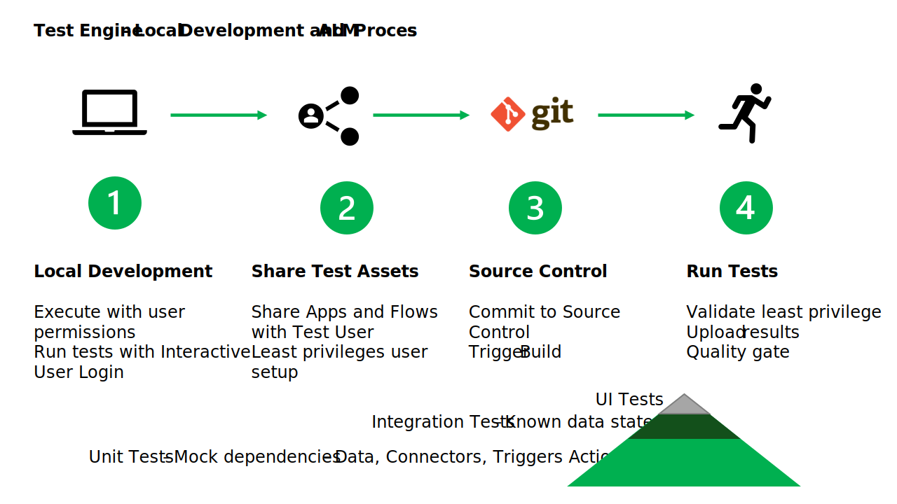

# Overview

Test Engine provides an extension model using [modules](./modules.md). Modules provide the following key benefits:

- A "no cliffs" extensibility model that code first developer can implement to extend the functionality of the test engine
- An extensible method of defining login credentials for the test session
- A provider module that different web resources can implement to that Power Fx expressions can be used
- An action model that allows new Power Fx test functions to be defined to simplify testing
- A security model where extensions can be signed by a trusted certificate provider
- A allow/deny security model that provides granular control on how actions are implemented

## Architecture

The extension model of test engine can be visualized in the following way

### Security Checks

Where a possible MEF extension does not meet the defined security checks, it will not be made available as part of test engine test runs.

#### Signed Assemblies

When using assemblies compiled in release mode the Test Engine will validate that:

- Assemblies are signed by a trusted Root certificate provider
- Assemblies and intermediate certificates are currently valid.

#### Allow / Deny List

As defined in [modules](./modules.md) optional allow deny lists can be used to control the following:

- Which MEF modules to allow / deny
- Which .Net namespaces are allow / deny
- Which .Net methods and properties and allow / deny.

Using these settings can provide a granular control of what modules are available and what code can be implemented in the a ITestEngineModule implementations.

### MEF Extensions

Test Engine will search the same folder as the Test Engine executables for the following MEF contracts

- **[IUserManager](..\..\src\Microsoft.PowerApps.TestEngine\Users\IUserManager.cs)** provide implementations to interact with the provider to authenticate the test session.
- **[ITestWebProvider](..\..\src\Microsoft.PowerApps.TestEngine\Providers\ITestWebProvider.cs)** allow extensions to build on the authenticated Playwright session to present the object model of the provider to and from the Power Fx test state.
- **[ITestEngineModule](..\..\src\Microsoft.PowerApps.TestEngine\Modules\ITestEngineModule.cs)** allow extensions to interact with network calls and define Power Fx functions used in a test

## No Cliffs Extensibility

The MEF extensibility model provides a method of extending the range of scenarios that Test Engine can cover. By implementing the defined MEF interfaces .Net assemblies can be implemented that provide alternative user authentication and web based tests.

The ITestEngineModule interface allows new Power FX functions to be defined that simplify testing by extending the provider or adding low code functions that are implemented in .Net.

## Local Development and ALM Process

The end to end process for test engine could be th following:

1. **Local Development** - Develop tests on local PC. At this stage the permissions of the maker can be used.

2. **Share Test Assets** - Share the Power Apps with test user account. Provide access to Managed Identity or Service principal to the definition of the Power Apps, Power Automate flows or Co-pilot.

   The user account that is setup with User permissions only. The user account must have created connection id to the required connectors.

3. **Commit Changes** - Save the changes to source control which will trigger build.

4. **Run Tests** - For unit tests they should be run with least privilege. Verify that:

   - User accounts only have permissions to start the application
   - By default that all Dataverse and Custom Connectors are mocked so that they cannot update source systems

### Test Types

Typically the majority of tests should be unit tests. Integration tests should be a smaller percentage of tests as the take longer to create and need to manage the state of system and secure access to secure resources. Finally UI tests conducted manual should be the smalled amount of tests as they require the greatest amount of review and human intervention to run and validate test results.
